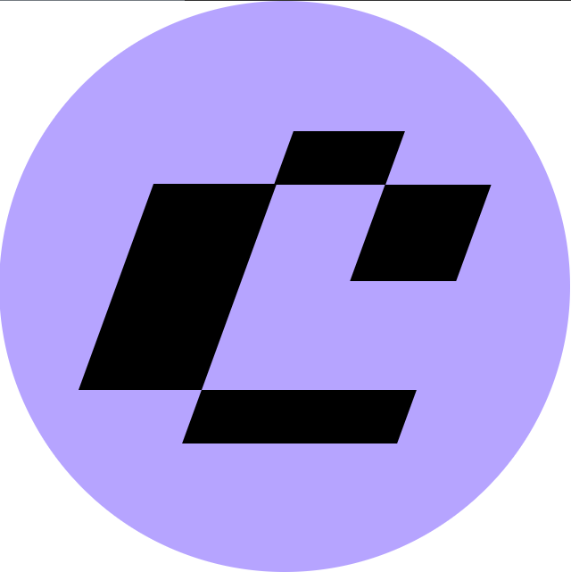

### Задание ##

Как-то Китти гулял по Мяутернету и наткнулся на сервис, где можно прокачивать свои навыки в разработке. И так ему понравился логотип этого сервиса, что решил он этот самый логотип нарисовать. Заодно и навыки CSS-художника прокачать.

Тебе нужно сверстать картинку 512 на 512 пикселей при помощи HTML и CSS.

Примечание
Вёрстка должна в точности соответствовать изображению.

Для рисования использовались следующие цвета: #B6A4FF, #FFFFFF, #000000.

### Результат  ###

### Инструменты реализации ###

1. HTML
2. CSS - *transform: skew()*