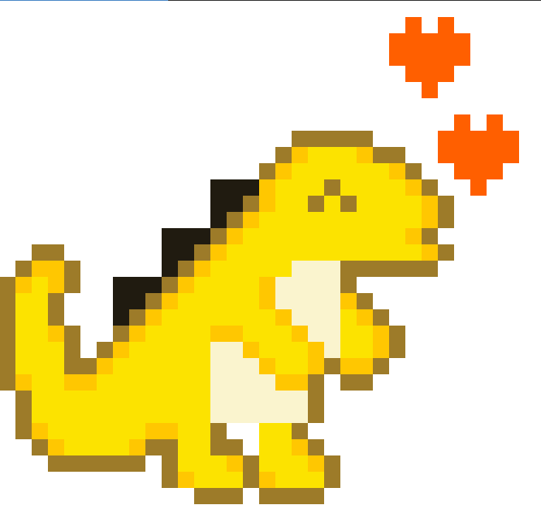

### Задание ##

Гуляя по городу, Китти заметил шагающих на Young Con весёлых драконов. Присоединившись к ним, он дошагал до самой конференции, классно провёл там время, завёл много новых знакомств. А уже после конференции решил увековечить воспоминания о своей приятной прогулке новым CSS-рисунком.

Тебе нужно сверстать картинку 512 на 512 пикселей при помощи HTML и CSS.

Примечание
Вёрстка должна в точности соответствовать изображению.

Для рисования использовались следующие цвета: #ffffff, #ff5f00, #9d7b29, #ffc701, #fce300, #201b10, #faf4ce.

### Результат  ###

### Инструменты реализации ###

1. HTML
2. CSS - grid