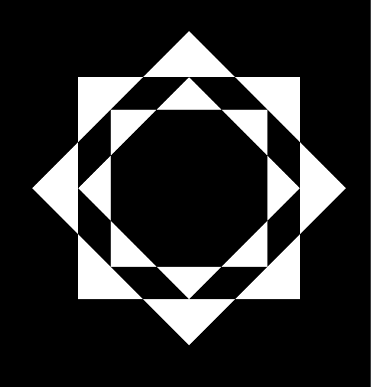

### Задание ##

Китти Мяурхол продолжает изучать различные приёмы и техники для создания интересных CSS-иллюстраций. Не так давно он наткнулся в Мяутернете на статью о режимах смешивания в CSS и тут же решил попробовать их в деле.

Тебе нужно сверстать картинку 512 на 512 пикселей при помощи HTML и CSS.

Примечание
Вёрстка должна в точности соответствовать изображению.

Для рисования использовались следующие цвета: #000000, #ffffff.

### Результат  ###

### Инструменты реализации ###

1. HTML
2. CSS - mix-blend-mode